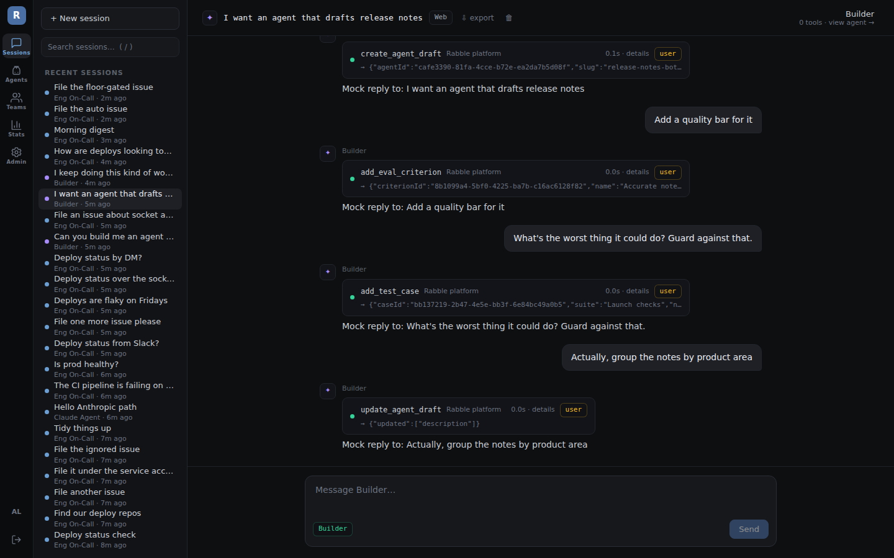
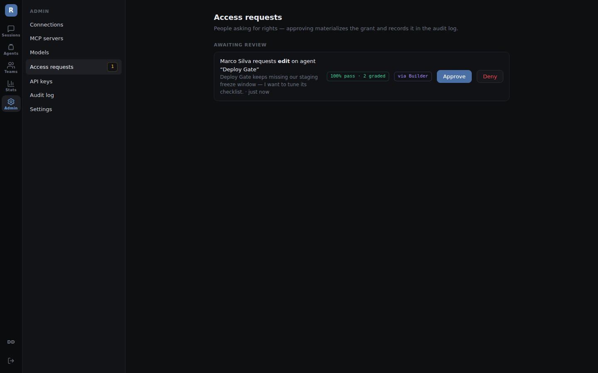
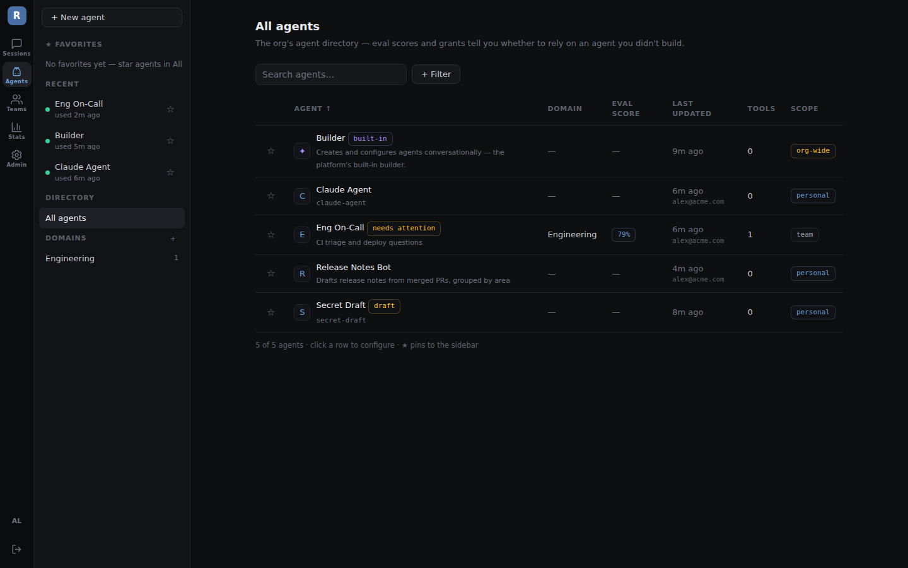
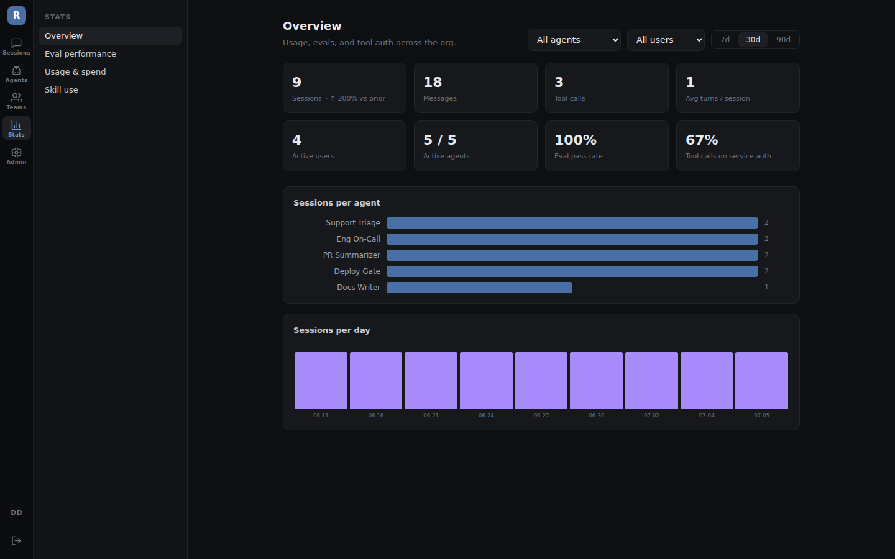
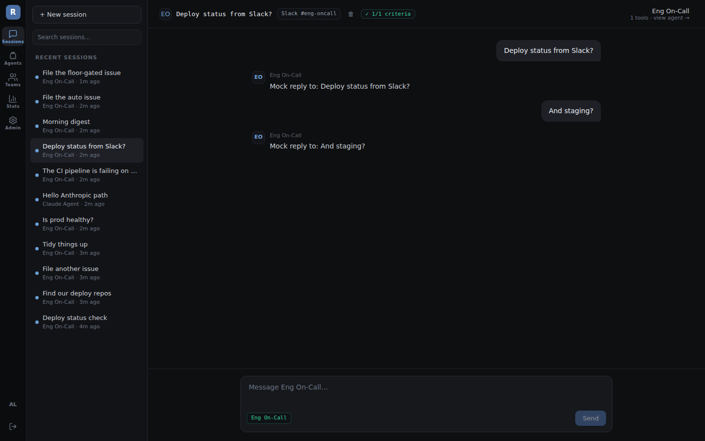
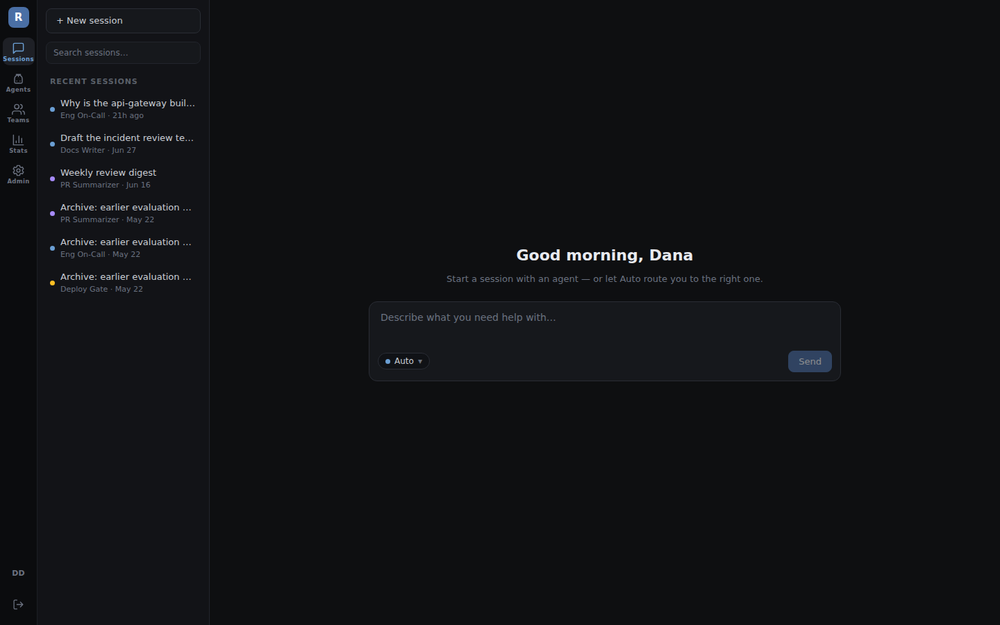

# Rabble

[](https://github.com/maxnorth/rabble/actions/workflows/ci.yml)

An open-source platform where a whole organization uses AI agents — and a
flexible subset of people create, configure, and govern them. Think "GitHub
for agents": agents as governed org citizens with identities, scoped access,
measured track records, and full auditability.

Website: [rabblehq.com](https://rabblehq.com) · npm packages live under the
[`@rabblehq`](https://www.npmjs.com/org/rabblehq) org.

What works today:

- **Sessions** — streaming agent chat with inline tool calls, in-thread
  approval cards (service vs. user auth on every tool, with the agent's
  track record as evidence), file artifacts, and per-user approval
  postures (always ask / once per session / trust) under an org-wide
  approval floor.
- **The Builder** — every org ships with a built-in agent that creates
  and configures agents *conversationally*, operating the platform
  through its own governed tools (drafts, eval criteria, test cases, MCP
  wiring) in the standard inline tool-call UI — every action approved by
  you and audited "via Builder". Agents are born measured.
- **Surfaces** — Slack channels and GitHub repos map onto agents, over
  **Socket Mode** (outbound WebSocket, no public URL needed) or signed
  webhooks: channel messages and issue comments become governed sessions
  (thread/issue = session, replies delivered back). Every message is
  attributed to its human author, participants see and can continue shared
  threads from the web, and opted-in users get a Slack DM when an agent
  replies somewhere they aren't watching.
- **Governance** — teams / domains / grants with real enforcement and
  cascade (no owners, only grants), **Share as one verb** (audience picker,
  plain-language rights, pause/unshare), **access requests** (ask from the
  agent page or let the Builder ask for you; admins approve next to the
  agent's measured track record), model-access grants, org policies
  (who can create agents, approval floor, retention), and a full
  control-plane audit log with CSV export.
- **Evals as evidence** — live criteria judged on real sessions, offline
  suites with freeze-a-session-as-test-case, **gating suites that block a
  regressing agent change before it saves**, a judge spot-check queue
  (disagree → human review → uphold/overturn), scope-violation tracking,
  30-day trust trends, and pass-rate-drop alerts that DM the agent's
  owner when quality sags.
- **Automations** — defined per agent and runnable on demand as real
  governed sessions on the Automation surface (recurring schedules land
  with the Hatchet-based scheduler).
- **Operations** — MCP server library with per-agent tool config, model
  registry (built-in catalog on one org key, or bring-your-own custom
  endpoints) with per-model pricing, usage & **spend** dashboards with
  prior-period trends, connections, scoped API keys, and per-user
  profiles/connected accounts.

All built on the design prototype's dark, dense visual system.

| | |
|---|---|
|  |  |
|  |  |
|  |  |

## Architecture

TypeScript monorepo (pnpm workspaces + Turborepo):

| Package | What it is |
|---|---|
| `packages/core` | Shared domain types and Zod schemas (the API contract between server and web) |
| `packages/server` | Fastify API + agent runtime: auth, agents, model registry, sessions with SSE streaming, Drizzle ORM on Postgres |
| `packages/web` | React (Vite) app: session experience + management surface |
| `packages/emulator` | Scriptable fakes of external services (Anthropic, OpenAI, MCP, Slack) for dev & e2e — the app only ever sees different base URLs |
| `packages/e2e` | Playwright journeys asserting UI, database state, emulator traffic, and clean server logs |

Everything is keyed by `org_id` from day one. The open-source version runs a
single default org; the same schema supports multi-tenant hosting later.

## Getting started (Docker)

```bash
cp .env.example .env   # set COOKIE_SECRET (and optionally ANTHROPIC_API_KEY)
docker compose up
```

That's it — Postgres, migrations, and the app. Open http://localhost:3080
and you'll be walked through creating the owner account.

## Getting started (local development)

Prereqs: Node 20+ and pnpm.

```bash
# 1. Start Postgres only
docker compose up -d postgres

# 2. Configure
cp .env.example .env   # set COOKIE_SECRET

# 3. Install, migrate, run
pnpm install
pnpm db:migrate
pnpm dev
```

The web app runs at http://localhost:5173 (dev, hot reload) and proxies API
calls to the server at http://localhost:3080.

Want it to look lived-in? `mise run seed-demo` (or
`pnpm --filter @rabblehq/server seed:demo`) fills the database with a demo
org — five agents with history, teams/domains/grants, eval trends, and
spend — no API keys needed. On a fresh database it also creates
`demo@acme.dev` / `demo-password-1`.

## Models

Rabble's model registry distinguishes two kinds of models:

- **Built-in** — a curated catalog (Claude models today). Configure a
  provider API key once in Admin → Models and every built-in model works.
- **Custom** — bring your own: pick the protocol (Anthropic- or
  OpenAI-compatible), a base URL (direct provider or any gateway), a model
  id, and a key. Register as many as you like.

## Deploying to Render

The repo ships a [`render.yaml`](render.yaml) blueprint: a Docker web
service plus managed Postgres, with `COOKIE_SECRET` and
`ENCRYPTION_SECRET` auto-generated and
migrations applied on every boot. Create a new Blueprint in Render pointing
at this repo and both resources provision automatically. (For a manually
created web service instead: set `DATABASE_URL`, `COOKIE_SECRET`,
`ENCRYPTION_SECRET`, and
`COOKIE_SECURE=true` in the dashboard — plus `DATABASE_SSL=true` if you use
the database's *external* URL.) Optionally set `ANTHROPIC_API_KEY` to enable
built-in Claude models.

## Development

Tool versions are pinned in [`mise.toml`](mise.toml), which is also the task
runner ([mise](https://mise.jdx.dev)):

```bash
mise install     # node + pnpm at pinned versions
mise run setup   # install deps, start Postgres, migrate
mise run dev     # server (:3080) + web (:5173) with hot reload
mise run check   # everything CI runs: typecheck + unit + e2e
mise tasks       # list all tasks (db, migrate, emulator, e2e:file, ...)
```

The underlying `pnpm` scripts (`pnpm dev`, `pnpm build`, `pnpm typecheck`,
`pnpm test`, `pnpm test:e2e`) still work directly if you don't use mise.

The e2e suite (`packages/e2e`) boots a fresh `rabble_e2e` database, the
production server build, and a mock streaming model endpoint, then drives the
whole journey in a real browser — owner setup, login, model registration,
agent creation, streamed chat — asserting UI state, database rows, and clean
server logs at every step. CI runs it on every push.

Product context and design decisions live in [`docs/`](docs/) — including
[connecting a real Slack workspace](docs/SURFACES.md) as an agent surface.
